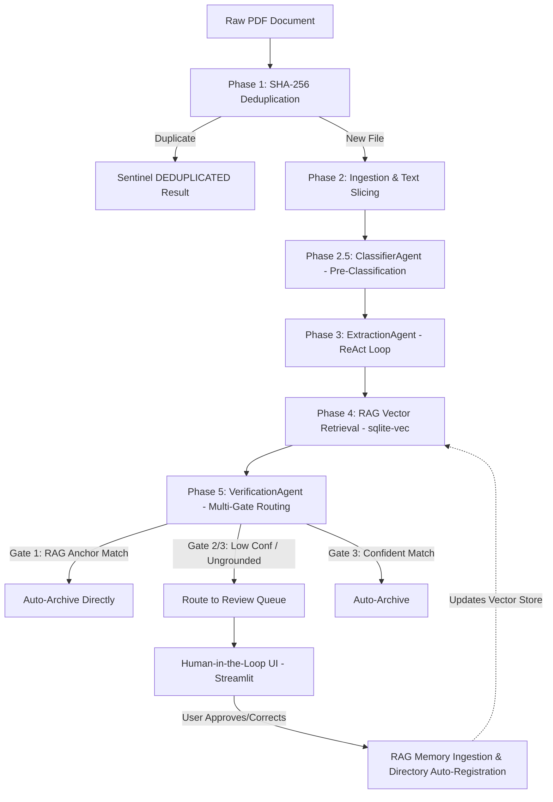
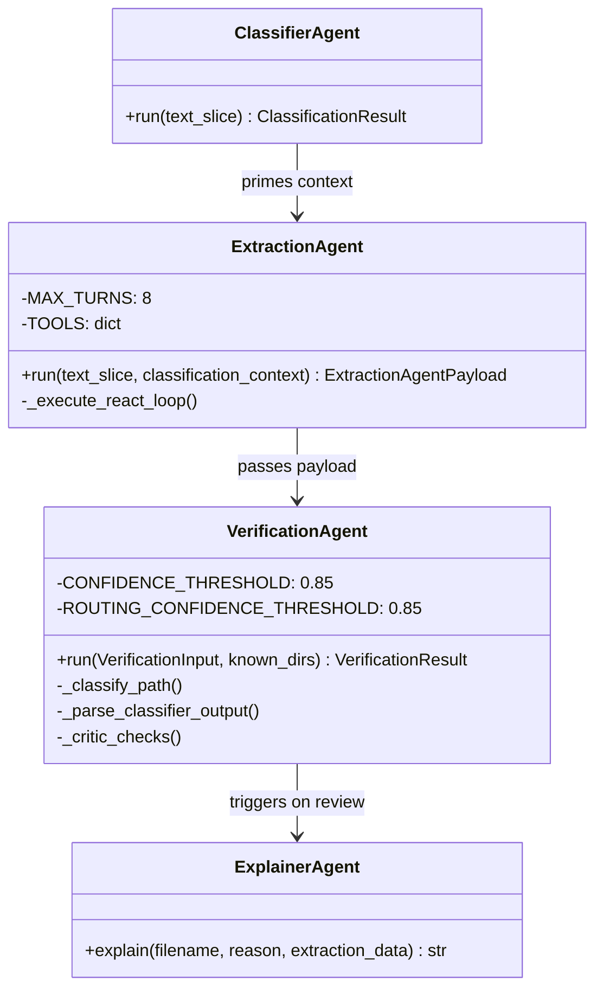
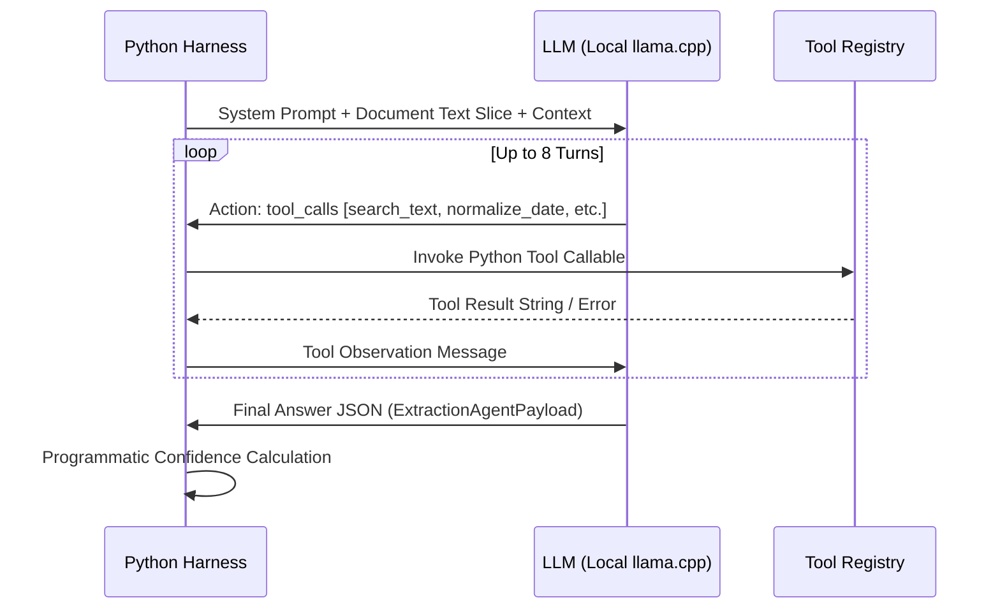
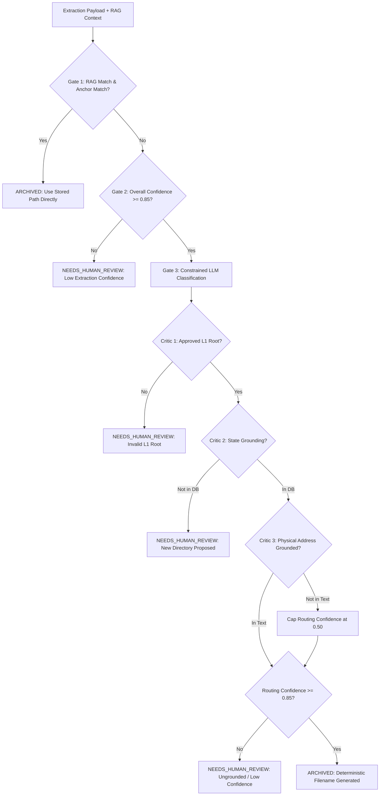
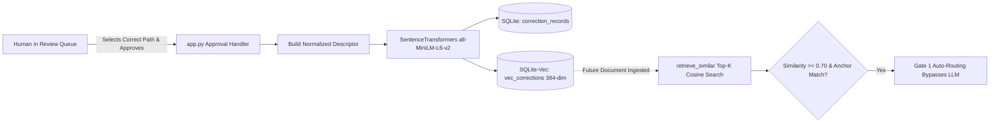

# Mail Organizer Pro — Ultra-Technical System Architecture & Agentic Specification

> **Audience & Purpose**: This document provides an exhaustive, blueprint-level technical specification of Mail Organizer Pro. It is specifically written to enable downstream AI agents and human architects to generate high-level system diagrams, sequence workflows, and presentation scripts explaining the agentic paradigms, reasoning loops, memory systems, and defensive harnesses.

---

## 1. Architectural Thesis & System Topology

Mail Organizer Pro is a **local-first, privacy-preserving, agentic document ingestion and routing pipeline**. It ingests unstructured, noisy PDFs (scanned receipts, utility bills, contractor invoices, legal letters), classifies their operational intent, extracts structured metadata, verifies taxonomic destination paths, and continuously learns from human feedback.

### Dual-Loop Philosophy: System 1 (Deterministic/RAG) vs. System 2 (LLM Reasoning)
The architecture rejects the anti-pattern of letting LLMs handle raw file I/O, arbitrary file system mutations, or unconstrained directory creation. Instead, it enforces a strict **Dual-Loop Hybrid Design**:
1. **System 1 (Deterministic Fast Path & RAG)**: File hashing (SHA-256 deduplication), OCR boundary slicing, regex extraction tools, vector similarity lookups (`sqlite-vec`), and programmatic critic checks.
2. **System 2 (Agentic Deliberation)**: Multi-turn ReAct loops for metadata extraction, zero-shot intent pre-classification, constrained taxonomic routing, and natural-language explanation generation.



---

## 2. End-to-End Pipeline Execution Lifecycle

The pipeline orchestrator (`pipeline.py` / `MailOrganizerPipeline`) connects six sequential phases:

```
[PDF Ingestion] 
   ├── Phase 1: SHA-256 Content Hashing & Deduplication
   ├── Phase 2: PDF Parsing (PyMuPDF / Tesseract OCR) & Boundary Slicing
   ├── Phase 2.5: Pre-Classification Agent (Context Pruning & ID Intent)
   ├── Phase 3: Extraction Agent (Autonomous Python ReAct Loop)
   ├── Phase 4: Local RAG Retrieval (Dense Embeddings + Anchor Guardrail)
   ├── Phase 5: Verification Agent (3-Gate Decision Funnel & Critic Checks)
   └── Phase 6: Persistence & HITL Explanation (Manifest / Review Queue)
```

### Phase 1: Cryptographic Deduplication
- Computes SHA-256 digest of input file.
- Checks `document_manifest` in SQLite. If hash exists, halts immediately; returns `PipelineResult(decision=DEDUPLICATED)` with no LLM token spend.

### Phase 2: Ingestion & Text Boundary Slicing
- Primary parser: PyMuPDF (`fitz`).
- Fallback parser: Tesseract OCR (`pytesseract` via PIL).
- Slicing (`ingestion/slicer.py`): Extracts document boundaries (header, body, footer) into a normalized text slice capped at standard context limits.

### Phase 2.5: Pre-Classification Stage (`ClassifierAgent`)
- Runs a fast, stateless single-turn LLM reasoning pass on the raw text slice before entering the heavy extraction loop.
- Classifies document type (`invoice`, `utility_bill`, `tax_form`, etc.), determines whether financial calculations are present, and identifies the expected anchor key (`account_number` vs `document_identifier`).

### Phase 3: Extraction Stage (`ExtractionAgent`)
- Runs an iterative **ReAct loop** (maximum 8 turns).
- Emits structured tool calls against deterministic Python helper functions to locate regex patterns, normalize messy date strings into ISO 8601 (`YYYY-MM-DD`), and parse currency values.
- Emits a final typed payload (`ExtractionAgentPayload`) with per-field confidence scores and an aggregate `overall_confidence`.

### Phase 4: Vector Retrieval Stage (`rag/vector_store.py`)
- Generates a 384-dimensional dense vector using `sentence-transformers` (`all-MiniLM-L6-v2`) on a normalized query descriptor: `entity | document_type | account_number | document_identifier`.
- Executes cosine distance search in SQLite using the `sqlite-vec` extension (`vec_corrections` virtual table).
- Applies similarity thresholding ($\ge 0.70$) and the **Anchor Key Guardrail** to determine if a human has previously authorized routing for this vendor.

### Phase 5: Verification & Routing Stage (`VerificationAgent`)
- Evaluates candidate destination paths using a **3-Gate Decision Funnel** and a **Three-Layer Critic Sandbox**.
- Checks RAG matches, extraction confidence, L1 taxonomy constraints, state grounding against known directories, and physical address token presence.

### Phase 6: Persistence & HITL Staging
- Auto-archives approved documents or routes uncertain documents to SQLite `review_queue`.
- On human review routing, `ExplainerAgent` runs a single-turn reasoning pass to draft a non-technical explanation of the missing or ambiguous data.

---

## 3. Deep Dive: Agentic Specifications & Reasoning Patterns



---

### 3.1 Agent 1: `ClassifierAgent` (Zero-Shot Triage)

- **Pattern**: Single-turn deterministic zero-shot classification.
- **Role**: Discovers the semantic domain of the document before extraction begins. Prevents the downstream extraction agent from confusing transactional account numbers with document-instance IDs (e.g. invoice numbers or work orders).
- **Prompt Structure**:
  ```json
  {
    "doc_type": "<invoice | utility_bill | service_report | bank_statement>",
    "id_field": "<invoice_number | account_number | tracking_number | none>",
    "id_hint": "<pattern or visual region hint>",
    "is_financial": true
  }
  ```
- **Input**: Raw text slice.
- **Output**: `ClassificationResult` Pydantic model (`doc_type`, `id_field`, `id_hint`, `is_financial`).

---

### 3.2 Agent 2: `ExtractionAgent` (Custom ReAct Tool-Calling Loop)

- **Pattern**: **Cyclic ReAct (Reason + Act + Observe)**. Built entirely in pure Python without external agentic frameworks (no LangChain, no CrewAI, no AutoGen).
- **Execution Harness**:
  - `MAX_TURNS = 8`.
  - Maintains a chronological message transcript (`messages: list[dict]`).
  - Turn cycle:
    1. **Reason**: LLM analyzes transcript + document text and emits tool calls.
    2. **Act**: The Python harness intercepts `tool_calls` JSON, validates function signatures, and invokes local Python functions.
    3. **Observe**: Output string (or `NO_MATCH` / `PARSE_ERROR`) is appended as a `tool` role message.
    4. **Termination**: Loop breaks immediately when the LLM outputs plain text containing a `Final Answer` JSON block, or when `MAX_TURNS` is exhausted.



#### The Deterministic Tool Registry:
1. `search_text(pattern, text)`: Python regex search returning capture group 1.
2. `extract_financial_totals(text)`: Programmatic heuristic scanner that detects labeled balances (`Total Due: $...`) and isolates currency tokens.
3. `normalize_date(raw)`: Parses multi-format natural dates (`08/01/26`, `Aug 1, 2026`) via `python-dateutil` into ISO 8601 (`YYYY-MM-DD`). Default locale is US (`dayfirst=False`).
4. `normalize_currency(raw)`: Strips currency signs, commas, and formatting into clean decimals (`1234.56`).

#### Confidence Calibration Engine:
Confidence is **never** left to LLM self-reporting alone. It is calculated deterministically based on tool grounding:
- If a value was verified via regex / date tool: `confidence = 1.0`.
- If a required field is missing or defaulted: `confidence = 0.0`.
- Core financial fields are heavily weighted in the aggregate calculation:
  $$\text{overall\_confidence} = \text{mean}(C_{\text{entity}}, C_{\text{date}}, C_{\text{doc\_type}}, C_{\text{total\_amount}}, C_{\text{account\_number}})$$

---

### 3.3 Agent 3: `VerificationAgent` (Constrained Classifier + 3-Layer Critic Sandbox)

- **Pattern**: Constrained LLM Classifier wrapped inside a **Defensive Multi-Gate Funnel**.
- **Role**: Maps an `ExtractionAgentPayload` to a rigid directory taxonomy.
- **Constraints**:
  - The LLM cannot invent arbitrary directories. It is presented with a bounded whitelist of `known_directories` from SQLite.
  - If a directory does not exist, the agent is forced to set `requires_new_directory = true`, triggering a human approval checkpoint.



#### The 3-Gate Funnel:
1. **Gate 1: RAG Memory Short-Circuit**:
   - If a verified RAG hit exists with `anchor_key_match = True`, the system **bypasses the LLM completely** and routes directly to the human-validated historical path.
2. **Gate 2: Extraction Confidence Gate**:
   - If `payload.overall_confidence < 0.85`, the LLM classifier is bypassed entirely. The document is flagged `NEEDS_HUMAN_REVIEW`.
3. **Gate 3: Constrained LLM Routing with Critic Harness**:
   - The LLM reasons over document metadata, taxonomy guidance, and `known_directories`.
   - The output is passed through three programmatic Critic checks:
     - **Critic Check 1 (L1 Root Whitelist)**: Ensures destination starts with an authorized root (`01_Finance`, `02_Home`, `03_Vehicles`, `04_Pets`, `05_Legal`, `06_Employment`, `07_Insurance`, `08_Travel`, `09_Personal`, `10_Rental_Property`, `11_Taxes`, `90_Archive`, `99_Unsorted`).
     - **Critic Check 2 (State Grounding)**: Verifies that if `requires_new_directory = false`, the path exists in SQLite `known_directories`.
     - **Critic Check 3 (Property Address Grounding)**: For `02_Home` routes, isolates the property slug (e.g. `45_Craighead_St_Pittsburgh_PA`) and checks whether distinctive street name tokens (e.g. `"craighead"`) exist in the OCR text. If absent, overrides `routing_confidence = 0.50`, forcing `NEEDS_HUMAN_REVIEW`.

---

### 3.4 Agent 4: `ExplainerAgent` (HITL Translation Agent)

- **Pattern**: Single-turn natural language translator.
- **Role**: Bridges the gap between raw programmatic logs and human reviewers.
- **Mechanism**: Reads low-confidence flags, missing fields, and routing reasons, and generates a warm, 2-sentence non-technical plain English summary in the Streamlit UI explaining exactly what needs manual confirmation.

---

## 4. Vector RAG Memory & Active Feedback Loop



### 4.1 Storage & Indexing (`rag/vector_store.py`)
- **Tables**:
  - `correction_records`: Plain SQL metadata table storing `entity`, `account_number`, `document_type`, `correct_path`, `descriptor`, `document_identifier`, and timestamp.
  - `vec_corrections`: SQLite virtual table powered by `sqlite-vec` storing 384-dimensional float embeddings linked via `rowid`.

### 4.2 The Descriptor Normalization Pattern
To prevent OCR noise from polluting embeddings, embeddings are generated over a **canonical semantic descriptor**, not raw document text:
$$\text{Descriptor} = \text{Entity} \parallel \text{Document Type} \parallel \text{Account Number} \parallel \text{Destination Path}$$
*Example*: `"Peoples Natural Gas | utility_bill | 123456789 | 02_Home/45_Craighead_St_Pittsburgh_PA/Utilities/Gas"`

### 4.3 Anchor Key Guardrail
Vector cosine similarity alone is insufficient for document routing (a gas bill from Account A is textually identical to Account B). The system enforces an anchor guardrail:
- **Ongoing Accounts (Utilities/Banking)**: Cosine similarity $\ge 0.70$ **AND** exact customer account match.
- **One-off Documents (Repairs/Invoices)**: Matches on entity name when accounts are absent, using human correction memory to associate independent contractors with specific properties.

---

## 5. Reasoning Paradigms & Control Harnesses

| Component | Reasoning Pattern | Termination Condition | Error Handling / Safeguards |
| :--- | :--- | :--- | :--- |
| **Ingestion / Slicer** | Deterministic Linear Pipeline | EOF / Buffer Sliced | Tesseract OCR fallback on blank fitz text |
| **`ClassifierAgent`** | Zero-shot Single Turn | Single inference response | Programmatic fallback to generic defaults on JSON error |
| **`ExtractionAgent`** | Cyclic ReAct Loop | Tool completion or Turn Limit ($N=8$) | Loop boundary clamp; regex syntax error trapping |
| **`VerificationAgent`** | Constrained Classifier + Multi-Gate | Single classification turn | 3 Critic checks; address grounding overrides; low confidence review routing |
| **`ExplainerAgent`** | Single-turn Translation | Single inference response | Non-technical prompt constraint; fallback string |
| **RAG Retrieval** | Vector KNN + Deterministic Filter | Nearest neighbors scanned | Similarity cutoff ($0.70$); anchor key guardrail |
| **Review Queue (HITL)** | Outer Human-in-the-Loop | Human click (`Approve`/`Reject`) | Re-verification schema check; vector store write |

---

## 6. Deterministic Naming & Storage Conventions

Filename generation is completely deterministic (`_generate_filename` in `verification_agent.py`) with zero LLM hallucinations permitted:

$$\text{Canonical Filename} = \text{YYYY-MM-DD}\_\text{Entity}\_\text{Description}\_\text{AnchorKey}.\text{ext}$$

- **Spaces & Characters**: Spaces, hyphens, and ampersands converted to single underscores. Stripped of all non-alphanumeric characters. Zero spaces permitted.
- **Anchor Key Resolution Order**:
  1. Real Customer Account Number (if present).
  2. Document Identifier (e.g. Invoice #, Work Order #).
  3. Deterministic Synthetic Anchor Key (`generate_unique_anchor_key` seeded from document hash with domain prefix: `H` for Home, `F` for Finance, `V` for Vehicles, etc.).

---

## 7. Slide Deck & Presentation Guide (Cheat Sheet for AI Agent)

When creating presentations, diagrams, or pitch scripts from this document, use this 4-part narrative arc:

### Slide 1: The Problem — The Fragility of Document Automation
- Traditional OCR regex pipelines break whenever document layouts shift.
- Naive LLM solutions hallucinate file paths, leak confidential data to cloud APIs, and lack deterministic safety bounds.

### Slide 2: The Core Innovation — The Dual-Loop Architecture
- Local LLM inference (Apple Silicon / Metal via `llama-cpp-python`).
- System 1 (Deterministic guardrails, regex tools, vector store) keeps System 2 (ReAct loops and LLM classifiers) inside an unbreachable sandbox.

### Slide 3: Self-Healing Active Learning (RAG Memory)
- Demonstrating the Human-in-the-Loop Flywheel:
  - Document arrives with missing street address $\rightarrow$ trips Critic Check 3 $\rightarrow$ sent to Manual Review.
  - Human approves destination once in the GUI $\rightarrow$ `sqlite-vec` indexes the decision.
  - Second document from the same vendor arrives $\rightarrow$ RAG Gate 1 triggers $\rightarrow$ Auto-Archived instantly without manual intervention.

### Slide 4: Enterprise Safety & Grounding
- Three-gate verification funnel.
- Address grounding check: preventing false property assumptions in multi-property portfolios.
- Zero-space canonical file naming with cryptographic SHA-256 deduplication.
